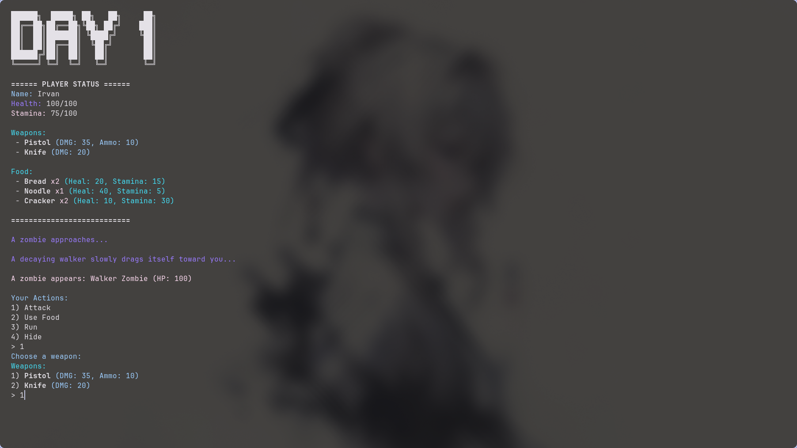

# 🧟‍♂️ **The Last 10 Days** — Retro Arcade Zombie Adventure

** — Retro Arcade Zombie Adventure

**Repository:** [https://github.com/IrvanKurniawan624/Last10Days-Game](https://github.com/IrvanKurniawan624/Last10Days-Game)

Step into a neon–soaked apocalypse where pixelated terror meets classic arcade charm. **The Last 10 Days** is a retro‑styled console adventure where survival, luck, and fast choices decide whether you see the sunrise on Day 10… or fall victim to the undead.

Brace yourself — grab your weapon, loot fast, and pray to the RNG gods. The city is crawling.

---

 ## 🎮 **Story**
                                               
A desperate journey across a collapsing world. A neon-lit retro nightmare.

**You have only 10 days to reach Arcadia — the last safe zone still standing.**

The undead swarm the streets. Districts fall one by one. Supplies are scarce, danger is everywhere, and every corner hides a new threat.

But rumors say Arcadia still has walls… still has life… still has hope.

Your mission is simple:
**Survive long enough to get there.**

---

## ⭐ **Key Features** (Arcade Style)

* 🗓️ **10‑Day Survival Challenge** — every run is different.
* 🎲 **RNG‑Driven Events** — lucky finds, brutal traps, traders, ambushes.
* 🧟 **Zombie Encounters** — fast, turn‑based fights with retro pacing.
* 🔫 **Classic Weapons** — bat, pistol, shotgun, and more.
* 🎒 **Inventory & Items** — food, meds, antibiotics, loot.
* ❤️ **Stats System** — health, stamina, infection.

---

## 🕹️ **How to Play**

1. Start a new run.
2. Choose your daily action:

   * Fight
   * Rest
   * Run
   * Daily Event
   * Use Items
3. Survive random events.
4. Fight (or flee from) zombies.
5. Manage resources.
6. Repeat until you hit **Day 10**… or die trying.

Every choice matters — some days bless you with loot, others curse you with hordes.

---

## 💾 **Installation & Running**

### **Clone the repo**

```bash
git clone https://github.com/IrvanKurniawan624/Last10Days-Game
cd Last10Days-Game
```

### **Compile**

```bash
javac -cp /usr/share/java/gson.jar -d out $(find src -name "*.java")   
```

### **Run**

```bash
java  -cp out:/usr/share/java/gson.jar Main                                                                    
```

## 🎯 **Gameplay Loop**

```
DAY START → Choose Action → Random Event / Zombie Encounter → Loot/Status Update → Next Day
```

Fast, simple, addictive — just like old arcade survival titles.

---

## 🎮 Controls

This is a console game — controls depend on menu choices:

```
1 / 2 / 3 / 4 / 5  → actions
Y / N              → confirmations
Enter              → continue dialogs
```

---

## 🏗️ **Project Structure**

```
src/
  actions/      // attack, hide, run, use item...
  systems/      // combat, random events, zombie system
  entities/     // survivor, zombies, items, weapons
  txt/          // ascii banners
  json/         // event data
Main.java
```

---

## 🛠️ Tech Stack

* **Java** (console)
* Minimal external dependencies
* Pure object‑oriented architecture with modular systems

---

## 👥 **Credits**

**Developer:** my-celp

---

## 🚁 **Final Goal**

Survive all **10 days** until rescue arrives.
Do that… and you win.

Die early?
that means *skill issue?.* including if you u baby mode

---

## 🔗 Links

* **GitHub Repo:** [https://github.com/IrvanKurniawan624/Last10Days-Game](https://github.com/IrvanKurniawan624/Last10Days-Game)
* **Issues:** Report bugs or request features directly on GitHub

---
